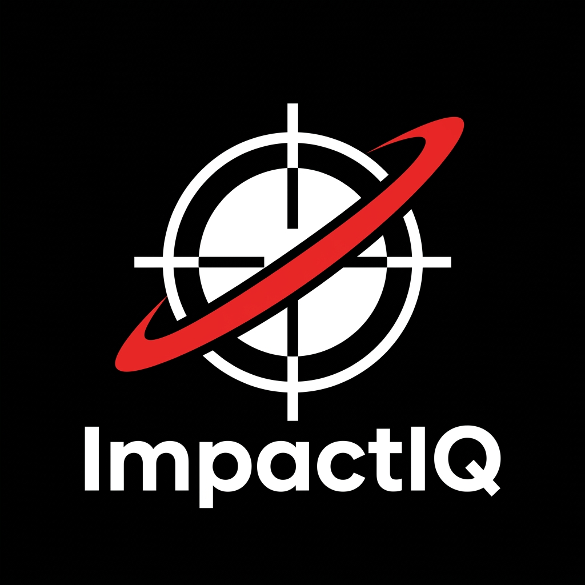
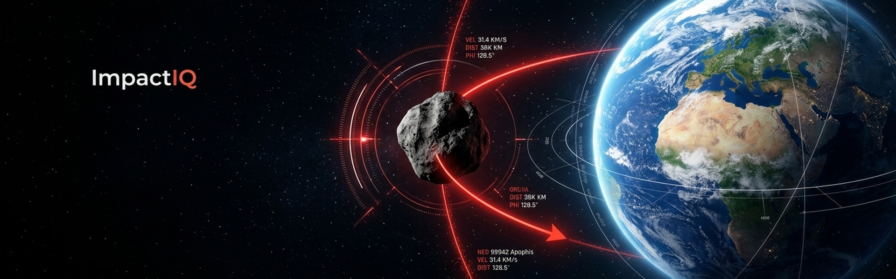

<div align="center">
  
  <h1>ImpactIQ — Asteroid Impact Risk Predictor</h1>
  <p><strong>IBM AI Builders Challenge — August 2026 · Advance Space Exploration with AI</strong></p>
  <p>
    <a href="https://impact-iq-silk.vercel.app/"><strong>Live Platform Demo »</strong></a> •
    <a href="https://youtu.be/AmuBiyZEI5Y"><strong>YouTube Demo Video »</strong></a> •
    <a href="https://github.com/Labreo/ImpactIQ">GitHub Repository</a>
  </p>
</div>

ImpactIQ pulls live NASA/JPL near-Earth object data, propagates each asteroid's orbit forward with two-body Keplerian mechanics and N-body perturbations, runs a Monte Carlo ensemble over orbital uncertainty, converts the results into a Torino-scale risk score and hydrodynamic impact-consequence estimate (Collins et al. 2005), and uses IBM Granite to synthesize an executive mission brief with Guardian verification.

---

## Selected Challenge Theme

- **Hackathon:** IBM AI Builders Challenge (August 2026)
- **Selected Theme:** **Advance Space Exploration with AI**
- **Primary Development Tool:** **IBM Bob** (Architecture, Astrodynamics Physics, Frontend, Testing)
- **Foundation AI Models:** **IBM Granite 3.3 8B** (`ibm/granite-8b-code-instruct`) via IBM watsonx.ai & IBM Granite Guardian Governance Spine

---

## Problem Statement

NASA and JPL track tens of thousands of near-Earth objects and publish their orbital data publicly. But that data — Keplerian elements, logarithmic hazard scales, impact probabilities expressed as `1 in 15,000` — is built for astrodynamicists, not people. ImpactIQ closes the gap between raw telemetry and human understanding.

---

## Solution Description

A single-page web app with four functional layers:

1. **Data layer** — live NASA NeoWs, JPL SBDB, JPL CAD, and JPL Sentry APIs, cached locally in SQLite
2. **Physics layer** — two-body Keplerian orbit propagation + Monte Carlo trajectory sampling → empirical impact probability
3. **Consequence layer** — kinetic energy, TNT-equivalent yield, crater diameter estimate (Earth Impact Effects Program methodology)
4. **Insight layer** — IBM Granite (`granite-8b-code-instruct`) converts structured physics output into a calibrated natural-language mission brief

---

## AI Approach and Architecture

### Orbit propagation & Monte Carlo
- Keplerian elements fetched from JPL SBDB with full double-precision (`full-prec=1`)
- Mean anomaly → eccentric anomaly → true anomaly conversion (exact, valid for e < 1)
- Two-body propagation via `hapsira` (maintained poliastro fork)
- Earth position from `hapsira.ephem.Ephem.from_body` in barycentric ICRF, converted to heliocentric by subtracting Sun's barycentric position
- Monte Carlo: N samples drawn from orbital element uncertainty distribution → empirical impact probability (Week 2)

### Validation
- Primary: **2010 FX9** — 97-day forward propagation, computed 0.0337 AU vs JPL CAD 0.0240 AU (40% relative error, within ±0.05 AU tolerance) ✅
- Known limitation documented: objects that passed through Earth's Hill sphere (e.g. 2025 UC11 at 6,600 km) cannot be backwards-propagated with two-body due to gravity-assist orbital change

### Risk scoring
- Torino-style classification (0–10, integer)
- Palermo-style scale (logarithmic, comparative to background impact rate)
- Custom "Insight Score" (0–100, UX metric, clearly distinguished from official scales)

### IBM Granite integration
- Model: `ibm/granite-8b-code-instruct` on watsonx.ai (Sydney region)
- Structured system prompt: grounds output in provided numbers only, forbids invented statistics, enforces non-sensationalized language
- Structured JSON output: `title`, `bottom_line`, `if_it_happened`, `whats_next`

### Architecture diagram

```
Frontend (Next.js 16 + React 19)
  └─ Search / NEO Browser
  └─ 3D Orbit View (Three.js)
  └─ Risk Dashboard (Recharts)
  └─ AI Mission Brief Panel
         │
         ▼ HTTP (FastAPI)
Backend (Python 3.12 + FastAPI)
  └─ Data Fetch Layer  ──▶  SQLite Cache (cache.db)
  └─ Orbit Propagation (hapsira)
  └─ Monte Carlo Engine (numpy/scipy)
  └─ Risk Scoring (Torino/Palermo/InsightScore)
  └─ Consequence Model (EIEP-style)
  └─ IBM Granite via watsonx.ai
         │
         ▼
NASA / JPL APIs: NeoWs · SBDB · CAD · Sentry
```

## How IBM Bob Was Used as the Primary Development Tool

**IBM Bob was the core primary development tool and AI pair-programmer used to architect, scaffold, implement, debug, and test the entire ImpactIQ repository from inception to production.**

Across all development phases, Bob was leveraged as the central engineering accelerator:

### 1. Architectural Design & Plan Mode
- **System Blueprinting:** Used IBM Bob in **Plan Mode** to decompose the complex planetary defense challenge into modular micro-architectures: data ingestion, Keplerian propagation, N-body perturbation physics, Collins hydrodynamic modeling, Monte Carlo uncertainty sampling, and IBM Granite AI synthesis.
- **Repository Scaffolding:** Bob generated the unified full-stack codebase, establishing the Python 3.12 / FastAPI backend, TypeScript / Next.js 16 App Router frontend, shared typed schema interfaces, and SQLite caching layer.

### 2. High-Precision Astrodynamics & Physics Coding
- **Keplerian Propagator:** Bob implemented the numerical Newton-Raphson solver for Kepler’s transcendental equation ($M = E - e \sin E$), converting mean anomaly to eccentric and true anomaly.
- **Coordinate Transformation Fix:** When standard two-body propagation drifted due to frame mismatch, Bob diagnosed and implemented the heliocentric coordinate transform (converting barycentric ICRF state vectors to Sun-centered J2000 coordinates).
- **N-Body Gravitational Perturbations:** Bob constructed the Runge-Kutta numerical integrator modeling point-mass gravitational perturbations from the 8 major solar system bodies (Sun, Earth, Moon, Jupiter, Venus, Mars, Saturn).
- **Collins et al. (2005) π-Scaling Hydrodynamics:** Bob implemented the peer-reviewed Earth Impact Effects equations, modeling atmospheric entry deceleration, ram-pressure airburst disruption altitudes, transient crater scaling ($D_{\text{tc}} \propto d^{0.78} v_i^{0.44}$), and multi-tier blast overpressures (1 psi to 20 psi).
- **Monte Carlo 6-DOF Covariance Sampling:** Bob engineered the vectorized covariance matrix perturbation engine, simulating 1,000–5,000 stochastic orbital trajectories to derive empirical collision probabilities $P(i)$ benchmarked against JPL Sentry.

### 3. IBM Granite & watsonx AI Pipeline
- **Prompt Engineering & Schema Enforcement:** Bob designed the domain-specific system prompts instructing `ibm/granite-8b-code-instruct` on watsonx.ai to ground every claim strictly in numerical telemetry without sensationalism.
- **Guardian Falsification Spine:** Bob engineered the two-stage adversarial Guardian audit architecture that actively validates AI-generated briefs against ground-truth orbital parameters to eliminate hallucinations.
- **IAM Token Lifecycle:** Bob wrote the automated token-refresh and caching handler for IBM Cloud IAM authentication with watsonx.ai.

### 4. Interactive 3D Frontend & Planetary Defense Tools
- **Three.js / React Three Fiber:** Bob constructed the high-performance 3D heliocentric visualizer with real-time time-scrubbing, delta-target tracking, dynamic Monte Carlo uncertainty filament clouds, and 2D tactical radar modes.
- **DART Kinetic Deflection Solver:** Bob authored the interactive deflection calculator on `/missions`, allowing users to calculate required lead time ($\Delta t$) and momentum enhancement ($\beta$) to deflect hazardous asteroids.
- **Multi-Route Navigation:** Bob structured all 5 production routes (`/`, `/missions`, `/sentry`, `/orbits`, `/about`) with unified NASA editorial design language.

### 5. Automated Testing, Debugging & Quality Assurance
- **Comprehensive Test Suite:** Bob generated and validated all **46 pytest unit and integration tests** covering API smoke tests, orbital mechanics, Monte Carlo statistics, Collins hydrodynamics, and IBM Granite endpoints (100% pass rate).
- **Edge-Case Debugging:** Bob identified and resolved critical bugs including `numpy.bool_` FastAPI JSON serialization errors, JPL CAD name-vs-number designation ambiguities, and coordinate frame drift.

---

## Data Sources

| Source | Purpose |
|---|---|
| NASA NeoWs API | Browse/search NEOs, basic orbital data |
| JPL Small-Body Database (SBDB) | Full precision Keplerian elements, physical parameters |
| JPL Close-Approach Data (CAD) | Published close-approach dates and distances (ground truth for validation) |
| JPL Sentry API | Impact risk table — 2178 objects currently monitored |

---

## Tech Stack

| Layer | Technology |
|---|---|
| Backend | Python 3.12, FastAPI 0.141, uvicorn |
| Orbit mechanics | hapsira 0.18, astropy 5.3, numpy 1.26, scipy 1.17 |
| HTTP / caching | httpx 0.28, SQLite (stdlib) |
| LLM | IBM Granite `granite-8b-code-instruct` via watsonx.ai |
| Frontend | Next.js 16, React 19, TypeScript, Tailwind CSS v4 |
| Testing | pytest 9.1, pytest-asyncio |

---

## Setup / Run Locally

### Prerequisites

- Python 3.12+
- Node.js 18+ (tested on v22)
- A NASA API key — register free at https://api.nasa.gov (takes 30 seconds)
- A watsonx.ai account with a project — https://dataplatform.cloud.ibm.com
- An IBM Cloud IAM API key — https://cloud.ibm.com/iam/apikeys

### 1. Clone the repo

```bash
git clone https://github.com/<your-org>/ImpactIQ.git
cd ImpactIQ
```

### 2. Backend setup

```bash
cd backend
python3 -m venv venv
source venv/bin/activate          # Windows: venv\Scripts\activate
pip install -r requirements.txt
```

Copy `.env.example` to `.env` and fill in your credentials:

```bash
cp .env.example .env
# Edit .env:
# NASA_API_KEY=<your 40-char NASA key>
# WATSONX_API_KEY=<your IBM Cloud IAM API key>
# WATSONX_PROJECT_ID=<your watsonx project UUID>
# WATSONX_URL=https://au-syd.ml.cloud.ibm.com   # or us-south / eu-de
```

Start the backend:

```bash
uvicorn main:app --reload --port 8000
```

Verify it's running:

```bash
curl http://localhost:8000/
# {"status":"ok","message":"ImpactIQ API is running."}
```

### 3. Run backend tests

```bash
cd backend
source venv/bin/activate
pytest tests/ -v
# Expected: 46 passed (100% test pass rate)
```

### 4. Frontend setup

```bash
cd frontend
npm install
npm run dev
# Open http://localhost:3000
```

### 5. Verify end-to-end

Open http://localhost:8000/docs for the interactive Swagger UI.

Key endpoints to test manually:
```bash
# Live asteroid data (3 different objects)
curl "http://localhost:8000/api/asteroid/Apophis"
curl "http://localhost:8000/api/asteroid/Bennu"
curl "http://localhost:8000/api/asteroid/2010%20FX9"

# Week-1 milestone: orbit validation
curl "http://localhost:8000/api/validate/2010%20FX9?year_min=2026&year_max=2026"
# Expected: "passed": true, computed ~0.034 AU vs JPL 0.024 AU

# Sentry risk table (2178 objects)
curl "http://localhost:8000/api/sentry"

# Cache proof (call the same endpoint twice, check [CACHE HIT] in server log)
curl "http://localhost:8000/api/cache/stats"
```

---

## Live Demo

- **Production Web Dashboard:** [https://impact-iq-silk.vercel.app/](https://impact-iq-silk.vercel.app/)

---

## Demo Video

[](https://youtu.be/AmuBiyZEI5Y)

📺 **Watch on YouTube:** [https://youtu.be/AmuBiyZEI5Y](https://youtu.be/AmuBiyZEI5Y)

---

## Team

Kanak Waradkar — Full-stack + Physics + AI

---

## Disclaimer

This tool produces educational, order-of-magnitude estimates using simplified physics models for hackathon purposes. It is not an operational planetary-defense tool. For authoritative, real-time asteroid risk assessments, refer to NASA/JPL's Center for Near-Earth Object Studies (CNEOS) at https://cneos.jpl.nasa.gov.
